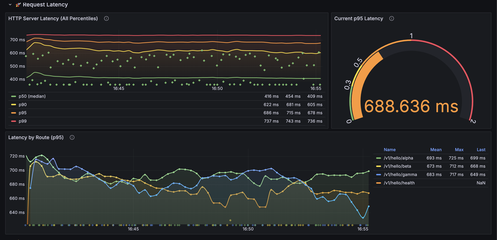

# OpenTelemetry Playground: Manual Instrumentation

Welcome to our hands-on guide to understanding OpenTelemetry through manual instrumentation of a Java application. We'll explore the core concepts of observability—traces, metrics, and logs—without the "magic" of auto-instrumentation. If you've ever wanted to understand how OpenTelemetry *really* works under the hood, this is the project for you.

We provide a fully-functional example demonstrating how to configure the OpenTelemetry SDK, create and manage signals, and correlate them to get a complete picture of your application's behavior. We'll also cover best practices, semantic conventions, and some of the quirks and less-known details I've discovered along the way.

#### Grafana dashboard


## Table of Contents

- [Quick Start](#quick-start)
  - [Make Targets](#make-targets)
- [Repo Map](#repo-map)
- [Project Architecture](#project-architecture)
- [Core OpenTelemetry Concepts](#core-opentelemetry-concepts)
    - [API vs. SDK](#api-vs-sdk)
    - [The Tracing Trio: Context, Span, and Scope](#the-tracing-trio-context-span-and-scope)
    - [Semantic Conventions: A Shared Language](#semantic-conventions-a-shared-language)
    - [Schema URL: Versioning Your Telemetry](#schema-url-versioning-your-telemetry)
- [Experimental OpenTelemetry Concepts](#experimental-opentelemetry-concepts)
    - [Exemplars (Beta)](#exemplars-beta)
    - [Span Links (Beta)](#span-links-beta)
    - [Other Evolving Concepts](#other-evolving-concepts)
- [Observability Signals](#observability-signals)
    - [Tracing: The Story of a Request](#tracing-the-story-of-a-request)
    - [Metrics: Measuring What Matters](#metrics-measuring-what-matters)
    - [Logging: Completing the Picture](#logging-completing-the-picture)
- [The Observability Stack (LGTM)](#the-observability-stack-lgtm)
- [Tips and Quirks](#tips-and-quirks)
- [What's Next](#whats-next)

## Quick Start

1.  **Start the observability stack and the application:**
    ```bash
    make up
    ```

2.  **Send a request:**
    ```bash
    curl http://localhost:8080/v1/hello/gelerion
    ```

3.  **Explore in Grafana:**
   -   Open Grafana: [http://localhost:3000](http://localhost:3000) (admin/admin123)
   -   Traces: Grafana → Explore → Tempo
   -   Metrics: Grafana → Explore → Prometheus (Prometheus UI also at [http://localhost:9090](http://localhost:9090))
   -   Logs: Grafana → Explore → Loki

4.  **(Optional) Generate continuous load:**
    In a new terminal, run:
    ```bash
    make load
    ```

5.  **Stop everything when you're done:**
    ```bash
    make down
    ```
### Make Targets

| Target                    | What it does                                    |
|---------------------------| ----------------------------------------------- |
| `make up`                 | Starts Docker stack, builds and runs the app    |
| `make down`               | Stops and removes the stack                     |
| `make send-request`       | Sends a single test request                     |
| `make load`               | Runs continuous load generator (default mode)   |
| `make load mode=high-latency` | Runs load generator with high latency   |
| `make logs`               | Tails app logs                                  |
| `make clean`              | Cleans Maven build artifacts                    |


## Repo Map

```text
├─ lgtm/                                  # Grafana, Loki, Tempo, Prometheus configs
├─ otel/
│  └─ otel-collector-config.yaml          # Collector pipeline (OTLP in; remote_write/OTLP out)
├─ src/main/java/com/gelerion/otel/playground/
│  ├─ config/otel/
│  │  ├─ SdkOtelConfig.java               # Global OpenTelemetry SDK wiring
│  │  ├─ SdkTracerProviderConfig.java   # BatchSpanProcessor, exporter
│  │  ├─ SdkMeterProviderConfig.java    # MetricReader, exporter, histogram views
│  │  └─ SdkLoggerProviderConfig.java   # Log signal setup
│  ├─ filters/before/                   # Context extraction, MDC, active_requests
│  ├─ filters/after/                    # Duration recording, active_requests decrement
│  ├─ controller/HelloWorldController.java
│  ├─ clients/RemoteClient.java         # HTTP client span + context injection
│  └─ repository/DbOperations.java      # DB client span + attributes
└─ src/main/resources/log4j2.xml        # OpenTelemetry appender + JSON layout
```

## Project Architecture

Our playground has three main pieces:

1.  **Java Application** (`otel-playground`)
    A small [Spark Java](https://sparkjava.com/) web app, which we've instrumented by hand using the OpenTelemetry SDK. Filters create and close spans, metrics are recorded on each request, and logs are enriched with trace context.

2.  **OpenTelemetry Collector**
    A pipeline that receives telemetry (traces, metrics, logs) from our app via OTLP, processes it in batches, and exports it to the appropriate backends.

3.  **LGTM Stack (Loki, Grafana, Tempo, Mimir/Prometheus):** A complete open-source observability stack, running in Docker.
    -   **Loki:** For log aggregation.
    -   **Grafana:** For visualization and dashboards.
    -   **Tempo:** For distributed tracing.
    -   **Prometheus:** For metrics.

> Why **Spark Java**? It's a lightweight web framework. This choice makes it easy to see exactly how OpenTelemetry is integrated without the complexities of a larger framework like Spring

**Data Flow Overview:**

```
[Java App] --(OTLP)--> [OTEL Collector] --+--> [Tempo] (Traces)
                                          +--> [Prometheus] (Metrics)
                                          +--> [Loki] (Logs)

[Grafana] <--- Queries --- [Tempo, Prometheus, Loki]
```

<details>
<summary>Detailed Application Request Flow</summary>

**1. Initialization**

Before any requests are handled, we manually initialize the OpenTelemetry SDK once at startup by calling [`SdkOtelConfig.init()`](./src/main/java/com/gelerion/otel/playground/config/otel/SdkOtelConfig.java).
This step configures and registers the global `OpenTelemetry` instance that we use throughout the application to create traces, metrics, and logs.

<details>
<summary>SdkOtelConfig Code Example</summary>
The programmatic setup involves a few steps:

1.  **Defining a `Resource`:** A `Resource` is a collection of attributes that identify the entity producing telemetry (i.e., your service). Attributes like `service.name` and `service.version` are essential for filtering and grouping data in your backend.

2.  **Configuring `ContextPropagators`:** This tells the SDK which wire protocol to use for passing context between services. We use the W3C Trace Context (`traceparent` header) and W3C Baggage (`baggage` header) standards, which is the recommended default.

3.  **Initializing Providers:** Each signal type has its own provider that controls how telemetry is processed and exported:
    -   `SdkTracerProvider`: For traces.
    -   `SdkMeterProvider`: For metrics.
    -   `SdkLoggerProvider`: For logs.

4.  **Building and Registering:** Finally, these components are assembled into the final `OpenTelemetrySdk` object, which is then registered as the global instance for the entire application.

```java
// SdkOtelConfig.java
public static void init() {
    // 1. Define service identity
    Resource resource = /* ... */;

    // 2. Configure propagators
    ContextPropagators propagators = ContextPropagators.create(
            TextMapPropagator.composite(
                    W3CTraceContextPropagator.getInstance(),
                    W3CBaggagePropagator.getInstance()
            )
    );

    // 3. Initialize providers for each signal
    SdkTracerProvider sdkTracerProvider = SdkTracerProviderConfig.create(resource);
    SdkMeterProvider sdkMeterProvider = SdkMeterProviderConfig.create(resource);
    SdkLoggerProvider sdkLoggerProvider = SdkLoggerProviderConfig.create(resource);

    // 4. Build the SDK and register it globally
    OpenTelemetrySdk openTelemetrySdk = OpenTelemetrySdk.builder()
            .setTracerProvider(sdkTracerProvider)
            .setMeterProvider(sdkMeterProvider)
            .setLoggerProvider(sdkLoggerProvider)
            .setPropagators(propagators)
            .build();

    GlobalOpenTelemetry.set(openTelemetrySdk);
}
```

</details>

**2. Request Interception (The `before` Filters)**

Spark Java's `before()` filters intercept all incoming requests. This is where the observability pipeline begins:

-   [`OtelContextPropagationBeforeFilter`](./src/main/java/com/gelerion/otel/playground/filters/before/OtelContextPropagationBeforeFilter.java): Extracts any incoming trace context from HTTP headers, creates the main `SERVER` span for the request, and makes it active for the current thread by creating a `Scope`.
-   [`LoggingTraceContextSetterBeforeFilter`](./src/main/java/com/gelerion/otel/playground/filters/before/LoggingTraceContextSetterBeforeFilter.java): This filter takes the `trace_id` and `span_id` from the now-active span and puts them into the logging context (MDC), ensuring all logs for this request are automatically correlated.
-   [`MetricsRecorderBeforeFilter`](./src/main/java/com/gelerion/otel/playground/filters/before/MetricsRecorderBeforeFilter.java): This filter increments the `http.server.active_requests` counter to track in-flight requests.

**3. Controller Logic**

The request then reaches the controller (e.g [`HelloWorldController.java`](./src/main/java/com/gelerion/otel/playground/controller/HelloWorldController.java)).
Here, we can enrich the active span with business-specific attributes or create new `CLIENT` spans for outbound calls to other services,
like the [`RemoteClient`](./src/main/java/com/gelerion/otel/playground/clients/RemoteClient.java) or [`DbOperations`](./src/main/java/com/gelerion/otel/playground/repository/DbOperations.java).

**4. Response and Cleanup (The `after` and `afterAfter` Filters)**

After the controller logic completes, the cleanup filters run:

-   [`MetricsRecorderAfterFilter`](./src/main/java/com/gelerion/otel/playground/filters/after/MetricsRecorderAfterFilter.java): This filter records the total request duration and decrements the active requests counter.
-   **`afterAfter` filter (in [`Server.java`](./src/main/java/com/gelerion/otel/playground/Server.java)):** This filter runs at the very end of the request lifecycle, even if an exception occurred. It performs the crucial final steps:
    -   Closing the `Scope` to deactivate the span and restore the previous context.
    -   Ending the `SERVER` span, which marks its completion and sends it to the exporter.
    -   Clearing the logging `ThreadContext` (MDC) to prevent context from leaking between requests.

This entire lifecycle can be visualized as follows:

```
Incoming Request
       │
       ▼
[Before Filters]─────────────────────────────────────────────┐
  1. OtelContextPropagationBeforeFilter.java                 │
     - Extracts trace context (or starts a new trace).       │
     - Creates a `SERVER` span.                              │
     - Creates a `Scope` to make the span active.            │
  2. LoggingTraceContextSetterBeforeFilter.java              │
     - Puts trace_id/span_id into the logging context (MDC). │
  3. MetricsRecorderBeforeFilter.java                        │
     - Increments `http.server.active_requests` counter.     │
       │                                                     │
       ▼                                                     │
[Controller Logic] (e.g., HelloWorldController.java)         │
   - Adds custom attributes/events to the active span.       │
   - Creates `CLIENT` spans for outbound DB/HTTP calls.      │
       │                                                     │
       ▼                                                     │
[After Filters]                                              │
  1. MetricsRecorderAfterFilter.java                         │
     - Records request duration and dec active requests.     │
       │                                                     │
       ▼                                                     │
[afterAfter Filter (Cleanup)] in Server.java ◄───────────────┘
   - Closes the `Scope`.
   - Ends the `SERVER` span.
   - Clears the logging context (MDC).
       │
       ▼
Outgoing Response
```
</details>

## Tutorial Path (Hands-on Labs)

Checkout the `labs-branch` for more details

## Core OpenTelemetry Concepts

### API vs. SDK

OpenTelemetry separates **what you instrument** from **how telemetry is processed**.

* **API (`opentelemetry-api`)**

    * What your application code calls.
    * Provides the classes for creating spans, recording metrics, and logging.
    * Lightweight and dependency-safe → libraries should only depend on the API.

* **SDK (`opentelemetry-sdk`)**

    * The actual implementation.
    * Decides *where* telemetry goes (console, OTLP collector, vendor backend).
    * Configured at runtime by your application.

**Why it matters:**  
This separation makes instrumentation portable. We can write code once (using the API) and later decide whether telemetry should go to Prometheus, Jaeger, or a commercial vendor simply by swapping the SDK configuration.

### The Tracing Trio: Context, Span, and Scope

Instrumenting traces requires a clear understanding of three key components that work together:

-   **Span:** Represents a single, timed unit of work (e.g., an HTTP request, a database query). It is the fundamental building block of a trace. We create a span, add attributes and events to it, and `end()` it when the operation is complete.

-   **Context:** An immutable, thread-local container that holds the *currently active* span, along with other request-scoped data like Baggage. When a new span is created, it automatically becomes a child of the span in the current `Context`.

-   **Scope:** The mechanism that makes a span active. A `Scope` is an `AutoCloseable` that, when created, places a span into the current `Context`. It's essential to wrap it in a `try-with-resources` block to ensure the previous context is restored after our unit of work is finished, preventing context leakage between different operations.

**Why it matters:**  
If `Scope` and `Context` are not managed correctly, spans will appear disconnected. Proper context handling ensures parent/child relationships are preserved across threads, filters, and service boundaries.


### Semantic Conventions: A Shared Language

Telemetry becomes powerful when everyone speaks the same language. That’s what [Semantic Conventions](https://opentelemetry.io/docs/specs/semconv/) provide — standardized attribute names like:

* `http.request.method` instead of `httpMethod`
* `db.system` instead of `dbType`

Key rules of thumb:

* **Span names** → low-cardinality, logical operations (`GET /users/{id}` not `/users/123`).
* **High-cardinality data** → goes into attributes, not names.
* **Tracer names** → identify the library/component (e.g., `com.example.playground.http`).

**Why it matters:**  
If you follow conventions, Grafana and other tools can automatically build dashboards, link metrics, and analyze data without custom parsing. If you don’t, you’ll end up with orphaned data that’s hard to use.

### Schema URL: Versioning Your Telemetry

Semantic conventions evolve over time. An attribute named `http.status_code` in one version might have been `http.status` in an older one. A **Schema URL** is a piece of metadata we attach to our telemetry that declares which version of the conventions it follows.

This allows a modern observability backend to receive data from two different services—one using an old SDK and another using a new one—and **normalize** the data. It can understand that `http.status` from the old service and `http.response.status_code` from the new service mean the same thing, allowing us to query them consistently.

In this project, we set the Schema URL when creating our `Tracer` instance in [`OtelContextPropagationBeforeFilter.java`](src/main/java/com/gelerion/otel/playground/filters/before/OtelContextPropagationBeforeFilter.java):

```java
// OtelContextPropagationBeforeFilter.java
public static Tracer tracer() {
    return GlobalOpenTelemetry
            .tracerBuilder("com.gelerion.otel.playground.http")
            .setInstrumentationVersion("1.0.0")
            .setSchemaUrl(SchemaUrls.V1_37_0) // Explicitly declare the convention version
            .build();
}
```

**Why it matters:**  
Without schema URLs, mixed-version telemetry across services can become inconsistent (e.g., http.status vs. http.response.status_code). Declaring schemas ensures tools can normalize and compare apples to apples.

## Experimental OpenTelemetry Concepts

### Exemplars (Beta)

Exemplars are a powerful feature that creates a direct link from a **metric** time-series back to a specific **trace**. For example, if a latency histogram shows a spike in its 99th percentile bucket, an exemplar attaches the `trace_id` of a request that fell into that bucket.

**Example:**

*   A histogram metric for `http.server.request.duration` shows a spike at 2.5 seconds.
*   An exemplar attached to that data point contains `trace_id=abc123`.
*   This allows us to jump directly from our Grafana dashboard into the specific trace in Tempo that caused the spike, turning a "what" question (latency is high) into a "why" investigation.

```java
// Example (conceptual, as actual support varies by SDK version)
Histogram latency = meter.histogramBuilder("http.server.request.duration").build();

// When recording a value, the SDK can automatically attach the current
// trace_id and span_id as an exemplar.
latency.record(2.5, Attributes.of(AttributeKey.stringKey("http.route"), "/hello"));
```

**Current status & limitations:**

*   While supported in the OpenTelemetry metrics SDK, full integration depends on the exporter and backend.
*   The standard Prometheus **scraping** model (reading from a `/metrics` endpoint) **does not support exemplars**. They are only preserved when using a push-based model, such as the Prometheus `remote_write` exporter. This is a key reason we use a push-based architecture in this project.
*   Visualization and usability in backends like Grafana are continuously improving.

**Why it matters:**  
Exemplars bridge the gap between aggregated metrics and specific, actionable trace data. They transform metrics from being purely observational into powerful debugging entry points.

### Span Links (Beta)

A **Span Link** allows you to connect a span to other spans that are causally related but not in a direct parent-child relationship. This is essential for accurately modeling distributed workflows that don't fit a simple, linear request-response tree.

Common use cases include:

*   **Batch Processing:** A single batch job span might process hundreds of items. Each item may have originated from a different initial request. The job span can use links to point back to the traces of all the items it processed.
*   **Asynchronous Workflows:** A producer sends a message to a queue. A consumer picks it up later in a completely separate trace. A Span Link connects the consumer's span back to the producer's span, preserving the causal link.

**Example:**

```java
// A batch processor receives work originating from two different producer operations.
// It can link its processing span back to both of them.
Span batchSpan = tracer.spanBuilder("process-batch")
    .addLink(producerSpanContext1)
    .addLink(producerSpanContext2)
    .startSpan();
```

**Current status & limitations:**

*   Supported in the OpenTelemetry SDK APIs, but backend support for visualizing these relationships varies.
*   Many UIs are optimized for simple parent-child trees and may not render links in an intuitive way.
*   Links are metadata; they don’t change the primary parent-child hierarchy of the trace.

**Why it matters:**  
Span Links are the key to modeling non-linear workflows (queues, async jobs, streaming) that don’t fit into strict parent/child trees.

### Other Evolving Concepts

*   **Exponential Histograms (Metrics):** A more efficient histogram type for capturing measurements over a large dynamic range (e.g., latency from nanoseconds to seconds). It provides high precision for small values while maintaining a bounded relative error for large values, using memory much more efficiently than traditional explicit-bucket histograms. Support is still experimental in some SDKs and backends.
*   **Logs Signal:** While OpenTelemetry provides logging appenders (like the Log4j2 one we use in this project), the full specification for logs as a first-class signal is still maturing. The goal is to have logs, traces, and metrics be fully interoperable and correlated by default, but integrations and conventions are still evolving across different languages and ecosystems.
*   **Baggage:** A mechanism for propagating key-value pairs (e.g., `tenant_id`, `user.id`) across service boundaries. Unlike trace context, which is for observability systems, Baggage is for application-level context. Stable in spec, but adoption varies (often underused).


## Observability Signals

### Tracing: The Story of a Request

A **trace** is the end-to-end journey of a request. You don’t create a trace directly — you create **spans**, and they’re linked by a shared `trace_id`.

#### The Lifecycle of a Span

1.  **Creation:** We use a `Tracer` to create a `SpanBuilder`, configure it (e.g., set the `SpanKind`), and call `.startSpan()`. This creates a `Span` object in memory with a start time and a unique `Span ID`.
2.  **Activation (Making it "Current"):** The new span is not yet active. To make it the "current" span for the active thread, we must activate it by creating a `Scope`. The `try-with-resources` pattern (`try (Scope scope = span.makeCurrent()) { ... }`) is essential for this. Inside this block, any new spans created will automatically become children of the active span, and other parts of the code can access it via `Span.current()`.
3.  **Enrichment:** While the scope is active, we add business context by setting `Attributes` (`span.setAttribute(...)`) or recording `Events` (`span.addEvent(...)`).
4.  **Ending the Span:** We must call `span.end()`. This is the critical step that records the end timestamp, calculates the final duration, and marks the span as complete and immutable.
5.  **Processing & Exporting:** Once a span is ended, the SDK hands it off to a configured `SpanProcessor`. In this project, we use the [`BatchSpanProcessor`](./src/main/java/com/gelerion/otel/playground/config/otel/SdkTracerProviderConfig.java), which collects spans in a buffer. Periodically, this processor hands the batch of completed spans to the `SpanExporter`. The exporter then serializes the span data into the OTLP format and sends it over the network to the OpenTelemetry Collector.

**Example**
```java
// 1. Create a span. It is not yet active.
Span span = tracer.spanBuilder("my-operation").startSpan();

// 2. Activate the span by creating a scope. This places the span in the current Context.
try (Scope scope = span.makeCurrent()) {
    // The "my-operation" span is now active for this thread.
    // Any new spans created here will automatically become its children.
    // Other code can get the active span via `Span.current()`.
} finally {
    // 3. The scope is closed automatically by the try-with-resources block.
    //    Always end the span to mark its completion.
    span.end();
}
```

#### Span Kinds and Naming

OpenTelemetry defines several `SpanKind` values to describe the nature of an operation. The most common are:

-   `SERVER`: An incoming request received by your service.
-   `CLIENT`: An outgoing call to a remote service (e.g., an HTTP call or a database query).
-   `INTERNAL`: An operation internal to the application that is interesting to trace (e.g., a complex calculation or a template rendering step).
-   `PRODUCER` / `CONSUMER`: For asynchronous operations involving message queues.

**Span names** should be low-cardinality (they don't contain unique IDs) and represent a logical operation, like `HTTP GET /users/{id}` or `DB SELECT users`. High-cardinality data, like `/users/12345`, belongs in attributes.

#### Connecting the Dots: Trace Propagation

A trace is "propagated" across service boundaries using headers. When our `RemoteClient` calls another service, it **injects** the current trace context into the outgoing request's headers. The receiving service then **extracts** this context and uses it as the parent for its own `SERVER` span.

OpenTelemetry defaults to the **W3C Trace Context** standard, which uses the `traceparent` and `tracestate` headers. A legacy format, B3 (used by Zipkin), is also widely supported for compatibility.

We demonstrate both sides of propagation in this project:
-   **Extracting (Server-side):** In [`OtelContextPropagationBeforeFilter.java`](./src/main/java/com/gelerion/otel/playground/filters/before/OtelContextPropagationBeforeFilter.java), the `propagator.extract()` method reads incoming headers to continue a trace.
-   **Injecting (Client-side):** In [`RemoteClient.java`](./src/main/java/com/gelerion/otel/playground/clients/RemoteClient.java), `propagator.inject()` adds the headers to an outbound HTTP request.

#### Advanced Correlation: Span Links

A **Span Link** allows you to connect two spans that are causally related but not in a direct parent-child relationship. This is useful for scenarios like batch processing, where one "producer" span might trigger hundreds of "consumer" spans that run independently. A link creates a shortcut from the consumer span back to the producer, making it easy to find the origin of the work.

<details>
<summary>Expand for Detailed Tracing Code Examples</summary>

**1. Creating the `SERVER` Span and Propagating Context (`OtelContextPropagationBeforeFilter.java`)**
This filter runs at the beginning of every request. It extracts the `traceparent` header, creates a `SERVER` span, and makes it active.

```java
// 1. Get the configured propagator (W3C Trace Context)
var propagator = GlobalOpenTelemetry.getPropagators().getTextMapPropagator();

// 2. Extract context from incoming request headers
Context extracted = propagator.extract(Context.current(), request, REQUEST_HEADERS_GETTER);

// 3. Create a SERVER span with the extracted context as its parent.
//    If no context was extracted, this will become a new root span.
var serverSpan = tracer().spanBuilder(request.requestMethod() + " " + request.pathInfo())
        .setSpanKind(SpanKind.SERVER)
        .setParent(extracted)
        .startSpan();

// 4. Activate the span by making its context current
Scope scope = Context.current().with(serverSpan).makeCurrent();

// 5. Store the scope and span on the request so the 'afterAfter' filter can clean them up
request.attribute(OTEL_SCOPE_ATTR, scope);
request.attribute(OTEL_SERVER_SPAN_ATTR, serverSpan);
```

**2. Creating a Database `CLIENT` Span (`DbOperations.java`)**
When the controller calls the database, we wrap that operation in a `CLIENT` span to measure it.

```java
// 1. Create a CLIENT span as a child of the current active span (the SERVER span)
Span span = OtelContextPropagationBeforeFilter.tracer().spanBuilder("DB SELECT users")
        .setSpanKind(SpanKind.CLIENT)
        .startSpan();

// 2. Make the span current and apply semantic attributes
try (Scope _ = span.makeCurrent()) {
    span.setAttribute(DbAttributes.DB_SYSTEM, "postgresql");
    span.setAttribute(DbAttributes.DB_OPERATION, "SELECT");
    // ... database logic ...
} catch (Exception e) {
    span.recordException(e);
    span.setStatus(StatusCode.ERROR);
    throw e;
} finally {
    span.end();
}
```

**3. Creating an HTTP `CLIENT` Span (`RemoteClient.java`)**
This is similar to the DB span, but with the crucial addition of injecting the trace context into the outgoing request headers.

```java
// 1. Create a CLIENT span
Span span = OtelContextPropagationBeforeFilter.tracer()
        .spanBuilder("HTTP POST /api/v1/recommend")
        .setSpanKind(SpanKind.CLIENT)
        .startSpan();

try (Scope _ = span.makeCurrent()) {
    HttpRequest.Builder builder = HttpRequest.newBuilder(/* ... */);

    // 2. Inject the current context into the request headers to propagate the trace
    GlobalOpenTelemetry.getPropagators()
            .getTextMapPropagator()
            .inject(Context.current(), builder, (carrier, key, value) -> carrier.header(key, value));

    // 3. Send the request...
} finally {
    span.end();
}
```

**4. Example Span JSON**

```json
{
  "name": "GET /v1/hello/:name",
  "context": {
    "trace_id": "5b8aa5a2d2c872e8321cf37308d69df2",
    "span_id": "051581bf3cb55c13"
  },
  "parent_id": null,
  "start_time": "2022-04-29T18:52:58.114201Z",
  "end_time": "2022-04-29T18:52:58.114687Z",
  "status_code": "STATUS_CODE_OK",
  "status_message": "",
  "attributes": {
    "http.route": "GET /v1/hello/name"
  },
  "events": [
    {
      "name": "Hello!",
      "timestamp": "2022-04-29T18:52:58.114561Z",
      "attributes": {
        "event_attributes": 1
      }
    }
  ]
}
```

</details>

<details>
<summary>Expand for Tracing Tips & Pitfalls</summary>

### Tips

When working with spans, a few best practices can save you from common mistakes and ensure your telemetry is both accurate and useful.

#### 1. Use Span Kinds Correctly

`SpanKind` isn’t just metadata — it defines the span’s role and shapes how backends visualize your system.

* **`SERVER`** → entry point into your service.
* **`CLIENT`** → outbound call to another service or dependency.
* **`INTERNAL`** → local operation inside your service.
* **`PRODUCER` / `CONSUMER`** → messaging and async pipelines.

Using the wrong kind breaks service maps and can misrepresent latency.  
[Spec: SpanKind](https://opentelemetry.io/docs/specs/otel/trace/api/#spankind)

#### 2. Attributes vs. Events

* **Attributes** → key-value pairs describing the *entire span*.

    * Example: `http.route="/users/{id}"`, `db.system="postgresql"`.
    * Best for filtering and querying.
* **Events** → timestamped records of *moments in time*.

    * Example: `"Cache miss"`, `"Acquired lock"`.
    * Best for debugging execution flow.

**Pitfall:** Avoid high-cardinality attributes (e.g., user IDs, stack traces). Instead, use events like `span.addEvent("Cache miss")` or exceptions (`span.recordException(e)`).

[Spec: Attributes](https://opentelemetry.io/docs/specs/otel/trace/api/#set-attributes)  
[Spec: Events](https://opentelemetry.io/docs/specs/otel/trace/api/#add-events)  
[Spec: RecordException](https://opentelemetry.io/docs/specs/otel/trace/api/#record-exception)


#### 3. Always Mark Errors Explicitly

By default, a span’s `status` is `UNSET`, which most UIs interpret as success.

* If an operation fails, you need to **do both**:

```java
span.recordException(e);
span.setStatus(StatusCode.ERROR);
```

**Pitfall:** Recording the exception alone does not change the status. Without `setStatus(ERROR)`, dashboards and SLOs will under-report errors.

[Spec: Set Status](https://opentelemetry.io/docs/specs/otel/trace/api/#set-status)  
[Spec: Exceptions](https://opentelemetry.io/docs/specs/otel/trace/semantic_conventions/exceptions/)


#### 4. Remember about Cardinality

* **Span Names** → must be low-cardinality.

    * Do    `GET /users/{id}`
    * Don't `GET /users/12345`
* **Attributes** → can carry higher cardinality (`user.id`, `request.id`), but excessive cardinality can still overload backends.

[Spec: Span Names](https://opentelemetry.io/docs/specs/otel/trace/api/#span)

</details>

### Metrics: Measuring What Matters

Metrics are numerical measurements aggregated over time, designed for efficiency and mathematical analysis (calculating rates, averages, percentiles). We define our primary metrics in [`MetricsProvider.java`](./src/main/java/com/gelerion/otel/playground/metrics/MetricsProvider.java).

Setting up metrics involves configuring the `SdkMeterProvider`:
-   **`MetricReader`**: Connects the SDK to an exporter. In this project, we use a `PeriodicMetricReader` to push metrics at a regular interval.
-   **`MetricExporter`**: Sends the metrics to a backend. Here, we use the `OtlpHttpMetricExporter`.
-   **Views**: Allow us to customize metric streams. A common use case is defining custom buckets for histograms, as shown in [`SdkMeterProviderConfig.java`](./src/main/java/com/gelerion/otel/playground/config/otel/SdkMeterProviderConfig.java).

<details>
<summary>Expand for Detailed Metrics Code Examples</summary>

**1. Defining a Metric Instrument (`MetricsProvider.java`)**
Instruments are created once and reused. Here, we define a histogram to measure server request latency, following semantic conventions for the name (`http.server.request.duration`) and unit (`s` for seconds).

```java
// MetricsProvider.java
private final Histogram serverRequestDurationHistogram;

public MetricsProvider() {
    Meter meter = GlobalOpenTelemetry.getMeter("otel-playground");

    this.serverRequestDurationHistogram = meter.histogramBuilder("http.server.request.duration")
            .setDescription("Measures the duration of inbound HTTP requests.")
            .setUnit("s")
            .build();
}
```

**2. Recording a Measurement (`MetricsRecorderAfterFilter.java`)**
After a request is handled, this filter calculates the duration and records a measurement on the histogram. The attributes attached to the measurement become the dimensions you can use to filter and group in Grafana.

```java
// MetricsRecorderAfterFilter.java
long start = request.attribute("start-time");
double seconds = (System.nanoTime() - start) / 1_000_000_000.0;

Attributes attributes = Attributes.builder()
        .put(HttpAttributes.HTTP_REQUEST_METHOD, request.requestMethod())
        .put(HttpAttributes.HTTP_RESPONSE_STATUS_CODE, response.status())
        .put(HttpAttributes.HTTP_ROUTE, request.pathInfo())
        .put("outcome", outcome) // Custom attribute: "success" or "error"
        .build();

metricsProvider.serverRequestDurationHistogram().record(seconds, attributes);
```

</details>

#### Connecting Metrics to Traces with Exemplars

An **Exemplar** is a powerful feature that links a specific metric measurement back to a trace that contributed to it. For example, if we see a spike in our p99 latency graph, exemplars allow us to click on that spike and jump directly to the trace of a request that was that slow. This is invaluable for debugging performance issues.

#### Push vs. Pull for Metrics

There are two primary models for getting metrics from an application to a backend like Prometheus:

1.  **Pull (Scraping):** The application (or the OTel Collector) exposes a `/metrics` endpoint, and Prometheus is configured to periodically scrape (pull) data from it. This is a very common and robust pattern.

2.  **Push (Remote Write):** The application (or the OTel Collector) actively sends metrics to the backend. This is the approach we use in this project. The Java app pushes metrics to the OTel Collector, which then uses the `prometheusremotewrite` exporter to push them to Prometheus.

The main reason for choosing the push model here is that the standard Prometheus scraping format **does not support exemplars**. To take full advantage of OpenTelemetry's correlation features, a push-based approach is often preferred.

#### The Duration: Seconds vs. Milliseconds

A common point of confusion is the unit for durations. OpenTelemetry and Prometheus semantic conventions recommend **seconds**. However, the default histogram buckets in the OTel SDK are often better suited for milliseconds (e.g., `[5, 10, 25, 50, 75, 100, 250, 500, 750, ...]`).

If durations are recorded in seconds with these default buckets, most of our data will likely fall into the very first bucket, making the histogram less useful. We address this in this project by defining a **View** to provide more granular buckets suitable for measurements in seconds.

Here’s a look at the configuration in [`SdkMeterProviderConfig.java`](./src/main/java/com/gelerion/otel/playground/config/otel/SdkMeterProviderConfig.java)
```java

SdkMeterProvider.builder()
    .setResource(resource)
    // Register a view to customize histogram buckets
    .registerView(
        InstrumentSelector.builder().setType(InstrumentType.HISTOGRAM).build(),
        View.builder()
            .setAggregation(Aggregation.explicitBucketHistogram(List.of(0.1, 0.2, 0.3, 0.5, 0.75, 1d, 1.5, 2, 3, 5, 7))).build()
    )).build();
```
#### Exponential Histograms

For high-dynamic-range data like latencies, **Exponential Histograms** can be more efficient and accurate than explicit-bucket histograms. They automatically adjust their resolution, providing smaller buckets for lower values and wider buckets for higher values, all with a constant relative error. While not explicitly configured in this project, they are a powerful feature to be aware of, especially for large-scale systems.


### Logging: Completing the Picture

The final piece is ensuring logs are correlated with traces. This is achieved by adding the `trace_id` and `span_id` to every log message.

To achieve trace-log correlation we need:

1.  **MDC Injection:** The [`LoggingTraceContextSetterBeforeFilter`](./src/main/java/com/gelerion/otel/playground/filters/before/LoggingTraceContextSetterBeforeFilter.java) manually puts the trace context into the Log4j2 `ThreadContext`. This is a viable approach if we are not using an OTel-native logging setup.

2.  **Ship to Collector via an OpenTelemetry Appender:** The [`log4j2.xml`](./src/main/resources/log4j2.xml) is configured with an `<OpenTelemetry>` appender. This appender automatically captures log records, enriches them with the active trace context (`trace_id`, `span_id`), and sends them directly to the OTel Collector as structured logs. This is the recommended approach for a fully integrated OpenTelemetry pipeline.

<details>
<summary>Expand for Detailed Logging Code Examples</summary>

**1. Configuring the Log4j2 Appender (`log4j2.xml`)**
The key is to add the `<OpenTelemetry>` appender. It automatically captures logs and, if it finds an active span in the `Context`, enriches the log record with the `trace_id` and `span_id`. The `captureContextDataAttributes="*"` is essential for capturing MDC data.

```xml
<!-- log4j2.xml -->
<Configuration>
    <Appenders>
        <!-- This appender ships logs directly to the OTel Collector -->
        <OpenTelemetry name="OpenTelemetryAppender"
                       captureContextDataAttributes="*"
                       captureCodeAttributes="true"/>
        <Console name="CONSOLE">
            <JsonTemplateLayout/>
        </Console>
    </Appenders>
    <Loggers>
        <Root level="INFO">
            <AppenderRef ref="OpenTelemetryAppender"/>
            <AppenderRef ref="CONSOLE"/>
        </Root>
    </Loggers>
</Configuration>
```

**2. Correlating Logs with Traces (`LoggingTraceContextSetterBeforeFilter.java`)**
This filter explicitly puts the trace context into the `ThreadContext` (MDC). While the `OpenTelemetryAppender` can find the context automatically, this approach ensures the IDs are also visible in console logs or file logs that *don't* go through the OTel appender, which is useful for local debugging.

```java
// LoggingTraceContextSetterBeforeFilter.java
public void handle(Request request, Response response) {
    SpanContext spanContext = Span.current().getSpanContext();
    if (spanContext.isValid()) {
        ThreadContext.put("trace_id", spanContext.getTraceId());
        ThreadContext.put("span_id",  spanContext.getSpanId());
    }
}
```

**3. Example of a Structured Log**
When you log a message from your controller, the appender and the JSON layout work together to produce a rich, structured log event like this, ready to be queried in Loki:
```json
{
  "timestamp": "2023-10-27T10:30:00.123Z",
  "level": "INFO",
  "message": "Handling hello request",
  "thread": "qtp123-22",
  "logger": "com.gelerion.otel.playground.controller.HelloWorldController",
  "trace_id": "a1b2c3d4e5f6a1b2c3d4e5f6a1b2c3d4",
  "span_id": "b1c2d3e4f5a6b1c2",
  "http.route": "/v1/hello/gelerion"
}
```

</details>


## The Observability Stack (LGTM)

In this project, we use the LGTM stack for a complete observability experience:

-   **Loki:** A horizontally-scalable, multi-tenant log aggregation system inspired by Prometheus. It indexes metadata (labels) about your logs, not the full log content, making it very cost-effective.
-   **Grafana:** The de-facto standard for open-source observability visualization. It allows us to create dashboards with data from Loki, Prometheus, Tempo, and many other sources.
-   **Tempo:** A high-volume, minimal-dependency distributed tracing backend. It's designed for finding traces by their ID and integrating seamlessly with Grafana, metrics, and logs.
-   **Prometheus:** An open-source systems monitoring and alerting toolkit. It scrapes metrics from configured endpoints, stores them, and supports a powerful query language (PromQL).

In Grafana, we can configure data sources to link signals together, for example, navigating from a trace in Tempo to the corresponding logs in Loki (`tracesToLogsV2`).

## Tips and Quirks

-   **Tracing:** Always use semantic conventions for attributes. This will make your traces much more useful. Use `CodeAttributes` to specify function names and line numbers for easier debugging.
-   **Spans:** Remember to always `end()` your spans. Use `try-with-resources` on the `Scope` returned by `span.makeCurrent()` to ensure context is correctly managed.
-   **Metrics:** Separate metrics for server, client, and database operations. This will lead to clearer dashboards and alerts. Don't forget to record failures as well as successes.
-   **Cardinality:** Be mindful of cardinality in metric attributes. High-cardinality attributes (like user IDs) can cause performance issues in your metrics backend. Span attributes can have higher cardinality.
-   **Context Awareness:** Be aware of the current context when recording signals. For example, if a metric is recorded in a `finally` block after the scope has been closed, it might not be associated with the correct span.
-   **Logging:** Don't forget to set `captureContextDataAttributes="*"` in your `log4j2.xml` `OpenTelemetryAppender` configuration. Otherwise, valuable MDC data will be lost in your logs.


## What's Next

This playground is a starting point. Once you’re comfortable, we recommend extending it:

1.  **Async Spans:** Instrument async tasks (e.g., in a `CompletableFuture` or thread pool) and learn how to propagate context across threads.
2.  **Baggage Propagation:** Use OpenTelemetry Baggage to pass business-relevant metadata (like a `tenant.id`) across service boundaries automatically.
3.  **Backend Swap:** Modify the `otel-collector-config.yaml` to send telemetry to a different backend, like Jaeger for traces or Elasticsearch for logs.
4.  **Transport Experimentation:** Switch the exporters from OTLP/HTTP to OTLP/gRPC and observe any differences in performance.
5.  **Framework Integration:** Try building a similar application using Spring Boot and Micrometer to compare the developer experience.

## Recap

- **Tracing**: [docs/tracing.md](docs/tracing.md) — Context/Span/Scope, propagation, async, links.
- **Metrics**: [docs/metrics.md](docs/metrics.md) — Instruments, views, buckets, exemplars.
- **Logging**: [docs/logging.md](docs/logging.md) — Appender, MDC, correlation.
- **Sampling**: [docs/sampling.md](docs/sampling.md) — Head and tail strategies, trade-offs.
- **Async**: [docs/async.md](docs/async.md) — Context propagation across threads and executors.
- **Dashboards**: [docs/dashboards.md](docs/dashboards.md) — How panels and queries work.
- **Semantic Conventions**: [docs/semconv-schema.md](docs/semconv-schema.md) — Naming, schema URLs, design principles.
- **Queries**: [docs/queries.md](docs/queries.md) — PromQL and LogQL cheat sheet.